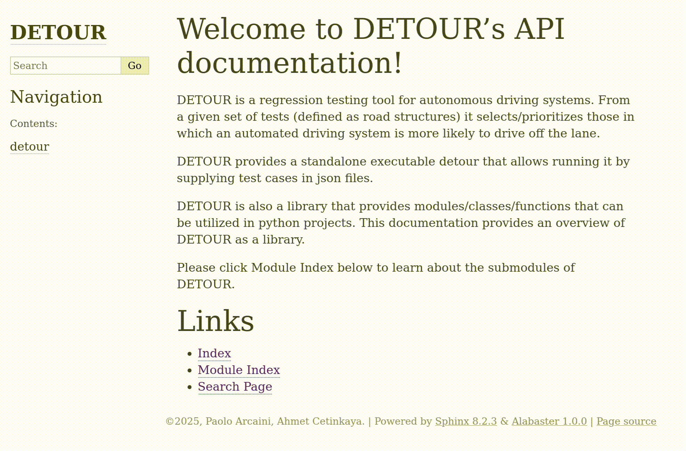

# What is DETOUR?

DETOUR is a regression testing tool for autonomous driving systems. From a given set of tests (defined as road structures) it selects/prioritizes those in which an automated driving system is more likely to drive off the lane.

# Requirements

DETOUR requires `python` (with version >=3.8, <3.14) for installation and standard operation together with numpy, matplotlib, and scipy libraries.

# Installation

We recommend the use of [`venv`](https://docs.python.org/3/library/venv.html) of Python for installation and use.

 - First install the `venv` module in Python, if it’s not already installed on your system.

 - Navigate to your `detour_project` folder and run the following command to create a new virtual environment named `env`:

~~~sh
python -m venv env
~~~

 - Activate the virtual environment. The command you use depends on your operating system. On macOS and Linux, run `source env/bin/activate`; on Windows run `env\Scripts\activate`. If you are running a terminal with a shell different from `bash` (e.g., `fish`, `zsh`, `csh`) you can find alternative scripts in `env/bin` folder.

- With the virtual environment activated, proceed with installation of [`poetry`](https://python-poetry.org/) build tool by running

~~~sh
pip install poetry
~~~

After `poetry` is installed, we will be able to build a wheel file in `dist` folder by running the following command inside `detour_project` folder:

~~~ sh
poetry build
~~~

As the next step, we use pip to install the built wheel file:
~~~sh
pip install dist/*.whl
~~~

You can now use detour as a standalone executable (`detour`) or import it in your python software projects via `import detour`.

- To deactivate the virtual environment when you're done, simply type `deactivate` at the command line. To run detour again, you can reactivate the virtual environment.

Here you can see installation on Linux in fish shell environment. If you are using another shell environment, please use the corresponding activation script.

# Basic Usage

DETOUR provides a standalone executable `detour`. This executable allows one to run detour with selection or prioritization functionality by supplying parameters as well as input files describing executed and not executed tests.

DETOUR also provides a library of functions that can be used in other python projects. The main module is `detour` and it provides the `DETOUR` class with methods `select` and `prioritize`.

Below we provide a detailed overview of standalone and library use cases.

## Usage of DETOUR as a standalone tool

DETOUR can be used as a standalone tool. Before we explain the tool we provide a quick overview of some example software that uses DETOUR's standalone tool.

### Example Software That Use DETOUR Standalone

In `detour_project/examples/standalone` folder, we provide two python files that use `detour` executable to select and prioritize codes. These files generate some plots of selected/prioritized roads.

#### Road selection

You can find the road selection example in `detour_project/examples/standalone/example_as_a_standalone_selection.py`. It can be executed with the following commands. Please make sure that the environment set up above is activated (run activation code for your shell enviornment).

~~~sh
cd examples/standalone
python example_as_a_standalone_selection.py
~~~

This will generate an output json file and a png plotting the selected roads.

#### Road prioritization

You can find the road prioritization example in `detour_project/examples/standalone/example_as_a_standalone_prioritization.py`. It can be executed with the following commands. Again, please make sure that the environment set up above is activated (run activation code for your shell enviornment).

~~~sh
cd examples/standalone
python example_as_a_standalone_prioritization.py
~~~

This will generate an output json file and a png plotting the prioritized roads.

### Description of Standalone Tool

DETOUR provides the command line standalone executable `detour` which accepts two json files describing executed tests and not-executed tests as input and produces a json file as output. The output file contains tests that are selected/prioritized from those in not-executed tests. In what follows we first describe input and output files and then explain all command line arguments that `detour` can utilize to specify its operation.

### Input - Output Overview

Below we first provide an overview of the json files used as inputs and outputs.

#### JSON File Template for Executed Tests

Executed tests specify a list of roads each with a test outcome. The shape of roads are described with Cartesian coordinates of a sequence of road points. The json file may look like:

~~~JSON
    [
     {"road_id": 1,
      "meta_data": {"test_info": {"test_outcome": "FAIL"}},
      "road_points" [{"x": 10.0, "y": 10.0}, {"x": 10.5, "y": 10.0}, ...]
     },
     {"road_id": 2,
      "meta_data": {"test_info": {"test_outcome": "PASS"}},
      "road_points" [{"x": 10.0, "y": 10.0}, {"x": 10.4, "y": 10.3}, ...]
     },
     ...
    ]
~~~

In the example json file above, `...` indicate more road_points/roads. For a complete example check the file `detour_project/examples/standalone/example_executed.json`.

Notice that in the description above, the first road with has test outcome `FAIL` and the second road has test coutcome `PASS`.

It is allowable to have keys such as ids and information about test-execution configurations as long as the keys `meta_data/test_info/test_outcome` and `road_points/[x, y]` are provided.

#### JSON File Template for Not-Executed Tests

Not-executed tests do not have a test outcome. Again the shape of roads are described with Cartesian coordinates of a sequence of road points. The json file may look like:

~~~JSON
    [
     {"road_id": 41,
      "road_points" [{"x": 30.0, "y": 20.0}, {"x": 30.1, "y": 20.2}, ...]
     },
     {"road_id": 42,
      "road_points" [{"x": 30.0, "y": 50.0}, {"x": 30.2, "y": 50.3}, ...]
     },
     ...
    ]
~~~

In the example json file above, `...` indicate more road_points/roads. For a complete example check the file `detour_project/examples/standalone/example_not_executed.json`.

It is allowable to have keys such as ids as long as the keys `road_points/[x, y]` are provided.

#### Output JSON File Produced by DETOUR

DETOUR produces a json file after selecting/prioritizing tests from those in not-executed tests, therefore the output file contains roads described in the json file provided for not-executed tests. The roads from ececuted tests are utilized in the selection/prioritization algorithm.

The json file may look like:

~~~JSON
    [
     {"road_id": 42,
      "road_points" [{"x": 30.0, "y": 50.0}, {"x": 30.2, "y": 50.3}, ...]
     },
     {"road_id": 41,
      "road_points" [{"x": 30.0, "y": 20.0}, {"x": 30.1, "y": 20.2}, ...]
     },
     ...
    ]
~~~

In the example json file above, `...` indicate more road_points/roads. 

### Command line arguments

The command line executable `detour` accepts many command line arguments. However, these arguments have default values and DETOUR will be able to run on those default values. Below we list all command line arguments and their default values.

#### JSON Files for executed not-executed and output tests
`--executed-filepath`, type=str, default="executed.json" (Filepath for the json file that provides executed test cases.)

`--not-executed-filepath`, type=str, default="not-executed.json" (Filepath for the json file that provides not-executed (prioritizable/selectable) test cases.)

`--output-filepath`, type=str, default="output.json" (Filepath for the json file that DETOUR outputs after prioritization/selection.)

#### Functionality: Test Case Prioritization, Test Case Selection
`--functionality`, choices=["prioritization", "selection"], default="prioritization" (Functionality to apply on not-executed tests, whether to prioritize them or to select among them.)

#### Test Case Prioritization-related arguments
`--prioritization-ratio`, type=float, default=1.0 (Ratio of tests to be returned among not-executed tests after prioritization.)

#### Test Case Selection-related arguments
`--selection-min-ratio`, type=float, default=0.05 (Minimum ratio of tests to be returned among not-executed tests after selection.)

`--selection-max-ratio`, type=float, default=0.4 (Maximum ratio of tests to be returned among not-executed tests after selection.)

`--selection-m-closest-neighbor-count`, type=int, default=4 (Number of closest neighboring test cases deemed to be passing in the stopping criteria for selection.)

`--selection-w-selection-threshold`, type=int, default=4 (Threshold for number of last selected test cases that are allowed to have m-closest-neighbor-count of neighbors passing to identify the stopping criteria for selection.)

#### Road section count for feature extraction
`--road_section-count`, type=int, default=6 (Road section count for extracting curvature/arclength features from road test cases.)

#### Random seed
`--random-seed`, type=int, default=0 (Seed for random operations in DETOUR algorithm.)

### Use for Test Case Selection

For test case selection, Test Case Selection-related arguments (`--selection-min-ratio`, `--selection-max-ratio`, `--selection-m-closest-neighbor-count`, `--selection-w-selection-threshold`) can be provided.

Below we provide an example where the goal is to select between 5% and 60% of not executed tests. The stopping criteria in detour's algorithm also depend of two extra parameters with m-closest-neighbor-count (m in short) and w-selection-threshold parameters (w in short). In this case we set both to 3. There is some randomness in selection to promote diversity. For repeatability we set `random-seed` argument. Here is the full command that achieves test case selection, assuming that the environment described in Installation section above is activated.

~~~sh
cd examples/standalone
detour --functionality selection --selection-min-ratio 0.05 --selection-max-ratio 0.6 --selection-m-closest-neighbor-count 3 --selection-w-selection-threshold 3 --executed-filepath example_executed.json --not-executed-filepath example_not_executed.json --output-filepath selection_result.json --random-seed 0
~~~

### Use for Test Case Prioritization

For test case prioritization, Test Case Prioritization-related argument (`--prioritization-ratio`) can be provided. It determines how many percent of the not-executed tests will be returned in the output. Of course the returned tests are in order of prioritization.

Below we provide an example where the goal is to prioritize 10% of not executed tests. If there are 50 not executed tests, the output will have 10 tests inside each describing a road. Here is the full command that achieves this test case prioritization task, assuming that the environment described in Installation section above is activated.

~~~sh
cd examples/standalone
detour --functionality prioritization --prioritization-ratio 0.1 --executed-filepath example_executed.json --not-executed-filepath example_not_executed.json --output-filepath prioritization_result.json
~~~

## Usage of DETOUR as a library

When installed, DETOUR also provides the detour module that provides functions to be used in other python project. An example is provided in `examples/library` folder.

## API Documentation

We provide an API documentation to help those who want to use DETOUR as a library. The documentation can be found in html format in the `docs` folder.

